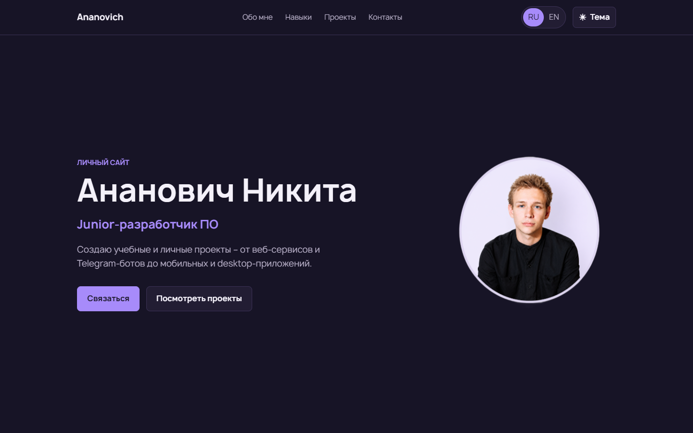

# personal-website

A bilingual personal portfolio website for a junior software developer.

The website presents personal and academic projects, skills, education, and contact information in a responsive single-page layout.

The website is implemented and available at [https://ananovich.ru/](https://ananovich.ru/).

## Features

- Russian and English localization
- Light and dark themes
- Responsive layout
- Project portfolio
- Contact links

## Tech stack

- HTML
- CSS
- JavaScript
